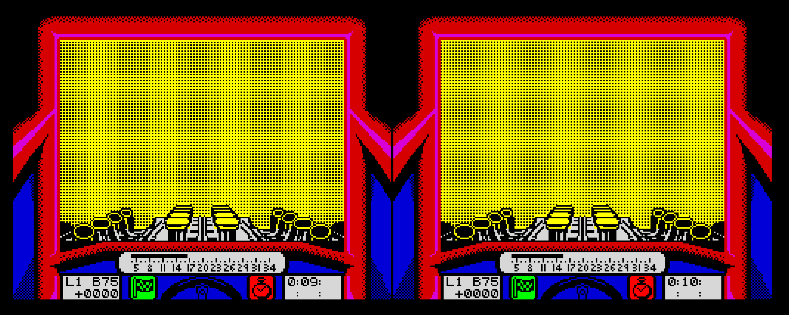

# WebAssembly ZXSpectrum Resampling

Use supersampling to remap non-square pixels for modern displays.

## Live Demo

https://binaryfoundry.github.io/zxsc/

# Supported Platforms

* HTML5
* Windows

# Requirements

* CMake 3.0 or greater
